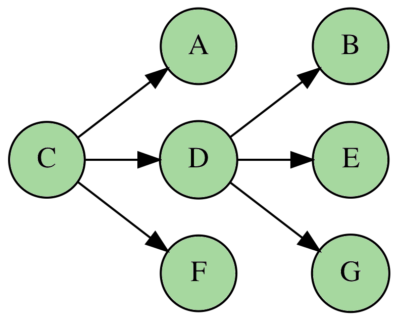
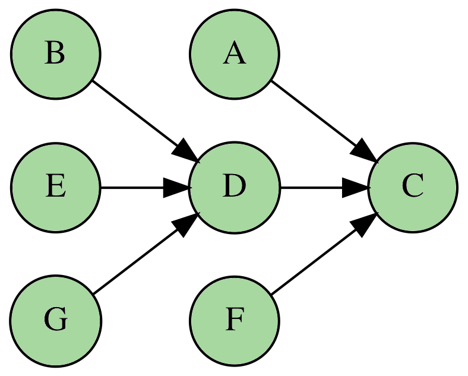
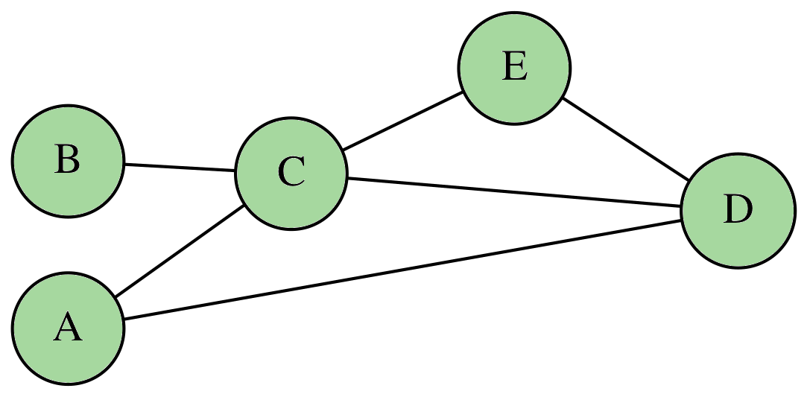
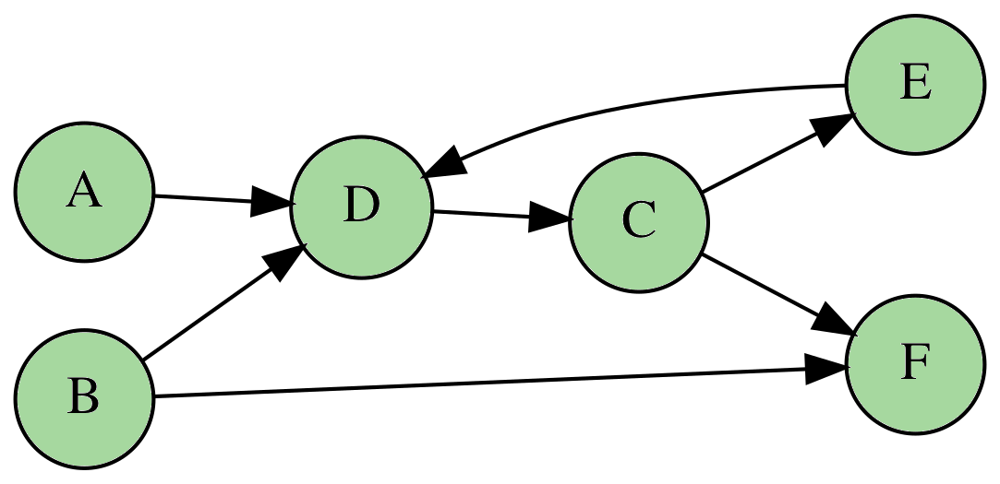
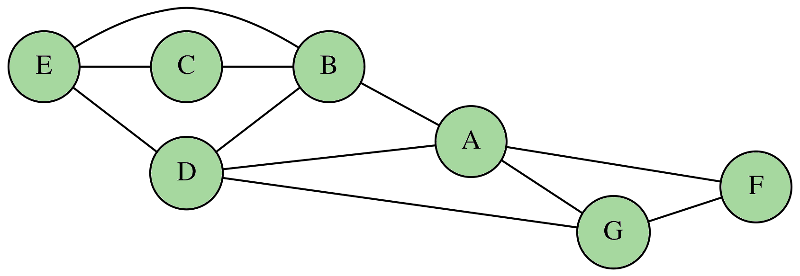

# Exercices

## Les exercices de base

!!! question "Exercice 1"

    On considère le graphe $G = (V, E)$ avec :

    \[
        V = \lbrace A, B, C, D, E\rbrace \quad \textrm{et} \quad E = \left\lbrace \rule[0.5cm]{0cm}{0pt} \lbrace A, B \rbrace, \lbrace A, C\rbrace, \lbrace A, E\rbrace, \lbrace B, D \rbrace, \lbrace C, D \rbrace\right\rbrace
    \]

    1. Quel est le degré du sommet $A$ ?
    2. Existe-il une chaîne entre $A$ et $D$ ?
    3. Représenter ce graphe.

??? tip "Indications"

    1. Il suffit de compter les arêtes contenant $A$.
    2. Il suffit de suivre les arêtes en partant de $A$ et voir si l'on arrive sur $D$.

??? bug "Correction"

    1. On compte exactement trois arêtes contenant $A$. D'où $\delta(A) = 3$.

    2. Il existe plusieurs chaînes possibles :

        \[
            \lbrace A, B \rbrace - \lbrace B, D \rbrace \quad \textrm{ou} \quad \lbrace A, C \rbrace - \lbrace C, D \rbrace  
        \]

    3. Une possibilité est : 

        <center>
            
        </center>

!!! question "Exercice 2"

    On considère le graphe orienté $G = (V, E)$ avec :

    \[
        V = \lbrace A, B, C, D, E, F\rbrace \quad \textrm{et} \quad E = \left\lbrace \rule[0.5cm]{0cm}{0pt} (A, D), (A, E), (B, A), (B, C), (C, F), (D, C), (F, B)\right\rbrace
    \]

    1. Déterminer les valeurs de $\delta^-(C)$ et $\delta^+(C)$.
    2. Combien y-a-t il de cycles partant du sommet $C$ ?
    3. Donner une représentation de ce graphe.

??? tip "Indications"

    1. $\delta^-(C)$ correspond au nombre d'arcs entrants du sommet $C$. On compte alors les arcs ayant $C$ pour cible.
    2. Il suffit de suivre les chemins possibles avec les arcs proposés.

??? bug "Correction"

    1. On a $\delta^-(C) = 2$ car il y a deux arcs avec $C$ comme cible et $\delta^+(C) = 1$ car un seul arc possède $C$ comme origine.
    2. Il y a deux cycles depuis le sommet $C$ donnés par les chemins :

        \[
            (C, F) - (F, B) - (B, C) \quad \textrm{et} \quad (C, F) - (F, B) - (B, A) - (A, D) - (D, C)
        \] 

    3. Une possibilité est : 

        <center>
            
        </center>

## Avec une liste d'adjacence

!!! question "Exercice 3"

    On considère le graphe dont la liste d'adjacence est donnée par :

    \[
        \begin{array}{ccl}
            \begin{array}{|c|}\hline A\\\hline\end{array} & \longrightarrow & \begin{array}{|c|}\hline B \\\hline\end{array}\\
            \begin{array}{|c|}\hline B\\\hline\end{array} & \longrightarrow & \begin{array}{|c|c|c|}\hline A & D & G \\\hline\end{array}\\
            \begin{array}{|c|}\hline C\\\hline\end{array} & \longrightarrow & \begin{array}{|c|c|}\hline D & E \\\hline\end{array}\\
            \begin{array}{|c|}\hline D\\\hline\end{array} & \longrightarrow & \begin{array}{|c|c|c|c|}\hline B & C & E & G\\\hline\end{array}\\
            \begin{array}{|c|}\hline E\\\hline\end{array} & \longrightarrow & \begin{array}{|c|c|}\hline C & D \\\hline\end{array}\\
            \begin{array}{|c|}\hline F\\\hline\end{array} & \longrightarrow & \begin{array}{|c|}\hline G\\\hline\end{array}\\
            \begin{array}{|c|}\hline G\\\hline\end{array} & \longrightarrow & \begin{array}{|c|c|c|}\hline B & D & F\\\hline\end{array}\\
        \end{array}
    \]

    1. Ce graphe est-il orienté ou simple ?
    2. Donner le degré du sommet $D$.
    3. Proposer un dictionnaire écrit en python implantant ce graphe.

??? tip "Indications"

    1. Il suffit de vérifier si chaque arête $(u, v)$ possède son symétrique $(v, u)$ dans la liste d'adjacence.

??? bug "Correction"

    1. Toutes les arêtes possèdent un symétrique dans la liste donc le graphe est simple.
    2. Le sommet de $D$ est $\delta(D) = 4$.
    3. On propose le dictionnaire :

        ``` python title="Proposition de correction" linenums="1"
        G = {   'A' : ['B'],
                'B' : ['A', 'D', 'G'],
                'C' : ['D', 'E'],
                'D' : ['B', 'C', 'E', 'G'],
                'E' : ['C', 'D'],
                'F' : ['G'],
                'G' : ['B', 'D', 'F']}
        ```

!!! question "Exercice 4"

    1. Écrire une fonction `degre(G : dict, s : str) -> int` qui renvoie le degré d'un sommet $s$.
    2. Compléter la fonction `degre_max(G : dict) -> str` qui renvoie le sommet de plus grand degré dans un graphe $G$ :

        ``` python title="Plus haut degré" linenums="1"
        from math import inf

        def degre_max(G : dict) -> str:
            res  = None
            maxi = -inf

            for el in G:
                if ... > ... :
                    res  = ...
                    maxi = ...

            return res
        ```

??? tip "Indications"

    1. Le degré correspond au nombre de voisins.
    2. Lorsqu'on trouve un sommet avec un degré plus grand, on le garde en mémoire.

??? bug "Correction"

    1. Le degré correspond à la longueur de la liste associée :

        ``` python title="Plus haut degré" linenums="1"
        def degre_max(G : dict, s : str) -> int:
            return len(G[s])
        ```

    2. On propose le code :

        ``` python title="Plus haut degré" linenums="1"
        from math import inf

        def degre_max(G : dict) -> str:
            res  = None
            maxi = -inf

            for el in G:
                if degre(G, el) > maxi :
                    res  = el
                    maxi = degre(G, el)

            return res
        ```

!!! question "Exercice 5"

    Pour un graphe orienté donné $G$, on appelle inverse de $G$, le graphe $\overline{G}$ dont tous les arcs ont été changés de sens.

    Par exemple, l'inverse de :

    <center>
        
    </center>

    est le graphe :

    <center>
        
    </center>

    1. Donner le dictionnaire python associé au graphe $G$ de l'exemple ci-dessus.
    2. Donner le dictionnaire python associé au graphe $\overline{G}$ de l'exemple ci-dessus.
    3. Écrire une fonction `inverser(g : dict) -> dict` qui à un dictionnaire donné renvoie le dictionnaire associé au graphe inversé.

??? tip "Indications"

    1. Facile
    2. Facile
    3. L'idée est **d'inverser** le dictionnaire associé à $G$.

??? bug "Correction"

    1. On a :

    ``` python title="Dictionnaire pour G" linenums="1"
    {'C': ['A', 'D', 'F'], 'D': ['B', 'E', 'G']}
    ```

    2. On a :

    ``` python title="Dictionnaire pour G" linenums="1"
    {'A': ['C'], 'B': ['D'], 'D': ['C'], 'E': ['D'], 'F': ['C'], 'G': ['D']}
    ```

    3. On propose :

    ``` python title="Dictionnaire pour l'inverse de G" linenums="1"
    def inverser(g : dict) -> dict:
        res = {}
        
        for el in g:
            for s in g[el]:
                if not s in res:
                    res[s] = [el]
                else:
                    res[s].append(el)
            
        return res
    ```

## Avec une matrice d'adjacence

!!! question "Exercice 6"

    On considère le graphe $G = (V, E)$ dont une représentation est donnée par

    <center>
        
    </center>

    1. Écrire la matrice d'adjacence associée à ce graphe.
    2. Proposer une instruction python permettant d'implanter cette matrice d'adjacence.

!!! question "Exercice 7"

    On considère le graphe $G = (V, E)$ dont la liste d'adjacence est donnée par :

    \[
        \begin{array}{ccl}
            \begin{array}{|c|}\hline A\\\hline\end{array} & \longrightarrow & \begin{array}{|c|}\hline D \\\hline\end{array}\\
            \begin{array}{|c|}\hline B\\\hline\end{array} & \longrightarrow & \begin{array}{|c|c|}\hline D & F \\\hline\end{array}\\
            \begin{array}{|c|}\hline C\\\hline\end{array} & \longrightarrow & \begin{array}{|c|c|}\hline E & F \\\hline\end{array}\\
            \begin{array}{|c|}\hline D\\\hline\end{array} & \longrightarrow & \begin{array}{|c|}\hline C\\\hline\end{array}\\
            \begin{array}{|c|}\hline E\\\hline\end{array} & \longrightarrow & \begin{array}{|c|}\hline D \\\hline\end{array}
        \end{array}
    \]

    1. Écrire la matrice d'adjacence de ce graphe.
    2. Proposer une représentation de $G$.

!!! question "Exercice 8"

    On s'intéresse dans cet exercice au passage d'une matrice d'adjacence à une liste d'adjacence.  

    On considère le graphe orienté $G = (V, E)$ dont la matrice d'adjacence est donnée par la liste python :

    ``` python title="Matrice d'adjacence" linenums="1"
    g = [[0, 1, 0, 1, 1], [0, 0, 0, 1, 0], [0, 0, 1, 1, 0], [0, 0, 0, 1, 1], [0, 1, 1, 0, 0]]
    ``` 
    1. En supposant que les sommets sont nommés $A, B, C, D$ et $E$, donner la liste d'adjacence de ce graphe.  
    2. Proposer une fonction python `matrix_to_list(g : list) -> dict` qui renvoie la liste d'adjacence d'un graphe passé en paramètre via sa matrice d'adjacence.  

    Par exemple, l'instruction `matrix_to_list(g)` renverrait :

    ``` python title="Exemple" linenums="1"
    {'A': ['B', 'D', 'E'], 'B': ['D'], 'C': ['C', 'D'], 'D': ['D', 'E'], 'E': ['B', 'C']}
    ``` 
    
!!! question "Exercice 9"

    On considère un graphe $G = (V, E)$ dont la matrice d'adjacence est donnée par la liste python :

    ``` python title="Matrice d'adjacence" linenums="1"
    g = [[0, 1, 0, 1, 1, 0], [1, 0, 0, 1, 0, 0], [1, 1, 0, 0, 1, 0], [0, 1, 1, 0, 0, 1], [1, 0, 1, 1, 0, 0], [1, 0, 0, 1, 1, 0]]
    ```

    1. Compléter le tableau suivant :

        \[
            \begin{array}{|l|c|c|c|c|c|c|}
                \hline
                \textrm{Sommet} & A & B & C & D & E & F\\
                \hline
                \textrm{Degré entrant } \delta^- & & & & & & \\
                \hline
                \textrm{Degré sortant } \delta^+ & & & & & & \\
                \hline
            \end{array}    
        \]

    2. Écrire une fonction python `degres(g : list) -> dict` qui renvoie le degré entrant et sortant de tous les sommets du graphe.  
    Par exemple pour le graphe 

        <center>
            
        </center>

        on aurait 

        ``` python title="Exemple" linenums="1"
        >>> degres(g)
        {'A': {'in': 0, 'out': 1}, 'B': {'in': 0, 'out': 2}, 'C': {'in': 1, 'out': 2}, 'D': {'in': 3, 'out': 1}, 'E': {'in': 1, 'out': 1}, 'F': {'in': 2, 'out': 0}}
        ```

!!! question "Exercice 10"

    On considère le graphe $G = (V, E)$ dont une représentation est :

    <center>
        
    </center>

    1. Écrire l'instruction permettant d'implanter ce graphe à l'aide d'une structure `array` du module `numpy` et de l'associer à la variable `g`.
    2. Écrire une fonction `power(t:array, n:int) -> array` qui calcule la puissance $n$-ième de la matrice `t` passée en paramètre.
    3. L'instruction `power(g, 4)` a renvoyé :
        ``` python title="Puissance quatrième" linenums="1"
        array([ [31, 22, 13, 26, 21, 13, 21],
                [22, 31, 13, 26, 21, 13, 21],
                [13, 13, 11, 17, 11,  6,  7],
                [26, 26, 17, 34, 18, 17, 18],
                [21, 21, 11, 18, 20,  7, 15],
                [13, 13,  6, 17,  7, 11, 11],
                [21, 21,  7, 18, 15, 11, 20]])
        ```
        Donner les chemins de longueur 4 reliant $C$ à $F$.
