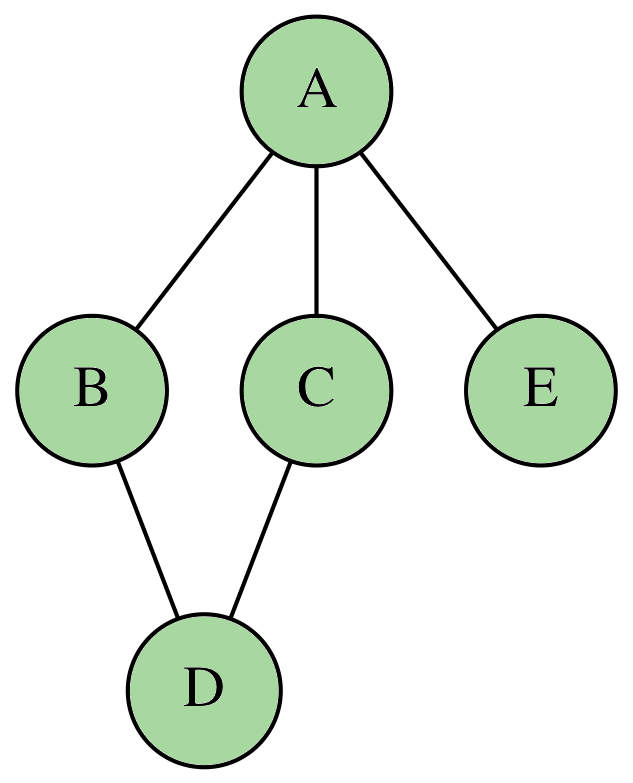
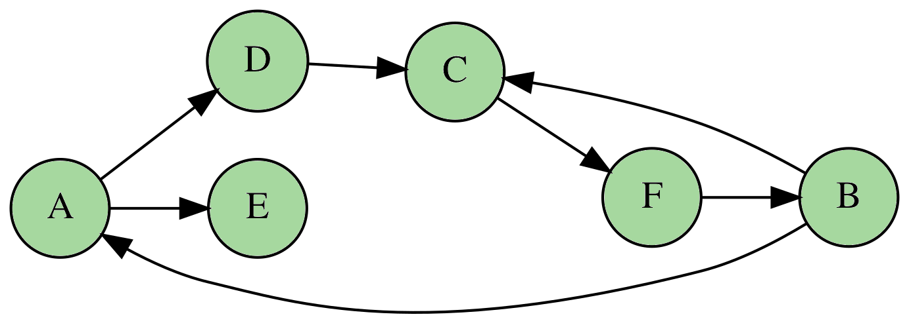

# Exercices

## Les exercices de base

!!! question "Exercice 1"

    On considère le graphe $G = (V, E)$ avec :

    \[
        V = \lbrace A, B, C, D, E\rbrace \quad \textrm{et} \quad E = \left\lbrace \rule[0.5cm]{0cm}{0pt} \lbrace A, B \rbrace, \lbrace A, C\rbrace, \lbrace A, E\rbrace, \lbrace B, D \rbrace, \lbrace C, D \rbrace\right\rbrace
    \]

    1. Quel est le degré du sommet $A$ ?
    2. Existe-il une chaîne entre $A$ et $D$ ?
    3. Représenter ce graphe.

??? tip "Indications"

    1. Il suffit de compter les arêtes contenant $A$.
    2. Il suffit de suivre les arêtes en partant de $A$ et voir si l'on arrive sur $D$.

??? bug "Correction"

    1. On compte exactement trois arêtes contenant $A$. D'où $\delta(A) = 3$.

    2. Il existe plusieurs chaînes possibles :

        \[
            \lbrace A, B \rbrace - \lbrace B, D \rbrace \quad \textrm{ou} \quad \lbrace A, C \rbrace - \lbrace C, D \rbrace  
        \]

    3. Une possibilité est : 

        

            
        

!!! question "Exercice 2"

    On considère le graphe orienté $G = (V, E)$ avec :

    \[
        V = \lbrace A, B, C, D, E, F\rbrace \quad \textrm{et} \quad E = \left\lbrace \rule[0.5cm]{0cm}{0pt} (A, D), (A, E), (B, A), (B, C), (C, F), (D, C), (F, B)\right\rbrace
    \]

    1. Déterminer les valeurs de $\delta^-(C)$ et $\delta^+(C)$.
    2. Combien y-a-t il de cycles partant du sommet $C$ ?
    3. Donner une représentation de ce graphe.

??? tip "Indications"

    1. $\delta^-(C)$ correspond au nombre d'arcs sortants du sommet $C$. On compte alors les arcs ayant $C$ pour cible.
    2. Il suffit de suivre les chemins possibles avec les arcs proposés.

??? bug "Correction"

    1. On a $\delta^-(C) = 2$ car il y a deux arcs avec $C$ comme cible et $\delta^+(C) = 1$ car un seul arc possède $C$ comme origine.
    2. Il y a deux cycles depuis le sommet $C$ donnés par les chemins :

        \[
            (C, F) - (F, B) - (B, C) \quad \textrm{et} \quad (C, F) - (F, B) - (B, A) - (A, D) - (D, C)
        \] 

    3. Une possibilité est : 

        

            
        

## En implantant avec un dictionnaire