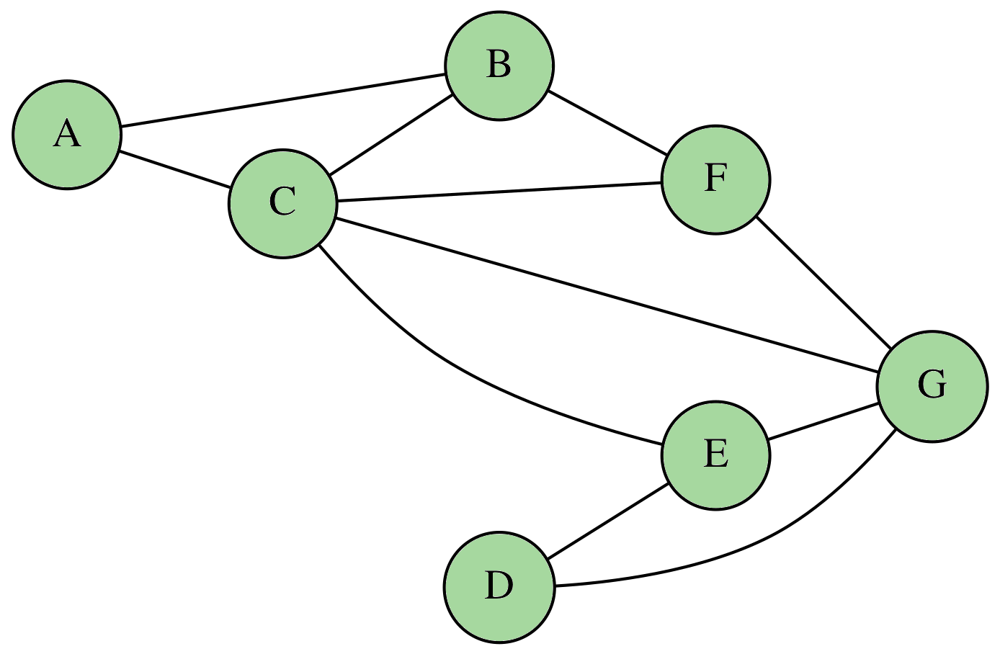

# Travaux pratiques

On s'intéresse dans ce TP aux graphes simples non orientés.

## Implantation par une classe

On propose d'implanter les graphes à l'aide d'une classe dont le corps principal est donné par le code suivant :

``` python title="Début d'implantation de GrapheSimple" linenums="1"

    from graphviz import Graph

    class GrapheSimple:
        
        def __init__(self, vertices:list):
            self.vertices = vertices
            self.edges    = {}
            
        def add_edge(self, start:str, end:str):
            pass
        
        def add_edges(self, edges : list):
            pass
        
        def show(self):
            dot = Graph(format='pdf', node_attr={'shape':'circle'})
            
            for s in self.edges:
                for e in self.edges[s]:
                    dot.edge(s, e)
                    
            dot.view()
```

On utilise le concept de liste d'adjacence pour implanter les graphes.

!!! question "Pour commencer"

    1. La méthode `add_edge(start:str, end:str) -> None` permet d'ajouter une arête à deux sommets existants passés en paramètre.  
        Compléter le code de cette méthode.

        !!! example "Utilisation de la méthode `add_edge`"

            On possède le graphe $G$ donné par `G = GrapheSimple(['A', 'B', 'C', 'D'])`.  
            Pour créer l'arête $\lbrace A, B\rbrace$, on utilise l'instruction `G.add_edge('A', 'B')`.

    2. La méthode `add_edges(edges:list) -> None` permet d'ajouter toute une liste d'arêtes passée en paramètre.  
        Compléter le code de cette méthode.

        !!! example "Utilisation de la méthode `add_edges`"

            On possède le graphe $G$ donné par `G = GrapheSimple(['A', 'B', 'C', 'D'])`.  
            Pour créer les arêtes $\lbrace A, B\rbrace$, $\lbrace A, C\rbrace$ et $\lbrace B, D\rbrace$, on utilise l'instruction `G.add_edges([('A', 'B'), ('A', 'C'), ('B', 'D')])`

??? tip "Indications"

    1. Il ne faut pas oublier de créer aussi l'arête réciproque.
    2. Utiliser la méthode `add_edge` dans une boucle.

??? bug "Correction"

    1. On ajoute l'arête à la liste si elle existe déjà. Sinon on crée la liste.

        ``` python title="Méthode `add_edge`" linenums="1"

        def add_edge(self, start, end):
            # Arête principale
            if start in self.edges:
                self.edges[start].append(end)
            else:
                self.edges[start] = [end]
            # Arête réciproque
            if end in self.edges:
                self.edges[end].append(start)
            else:
                self.edges[end] = [start]
        ```

    2. On propose le code :

        ``` python title="Méthode `add_edge`" linenums="1"

        def add_edges(self, edges):
            for el in edges:
                self.add_edge(el[0], el[1])
        ```

On se propose d'implanter en Python le graphe ci-dessous :

<center>
    
</center>

!!! question "Implantation du graphe"

    1. Proposer deux instructions permettant d'implanter le graphe ci-dessus et de l'associer à la variable `G`.
    2. Vérifier que l'instruction `G.show()` affiche un graphe pas très joli.
    3. Corriger la méthode `show` pour qu'elle ne trace pas des arêtes déjà tracées.

??? tip "Indications"

    1. Utiliser le constructeur `G = GrapheSimple([...])` puis l'instruction `G.add_edges([...])`.
    2. Cette méthode trace deux arêtes à la place d'une seule.
    3. Tester si l'arête à tracer a déjà été tracée.

??? bug "Correction"

    1. On utilise le code :

        ``` python title="Construction d'un graphe simple" linenums="1"

        G = GrapheSimple(['A', 'B', 'C', 'D', 'E', 'F', 'G'])
        G.add_edges([('A', 'B'), ('A', 'C'), ('B', 'C'), ('B', 'F'), ('C', 'E'), ('C', 'F'), ('C', 'G'), ('D', 'E'), ('D', 'G'), ('E', 'G'), ('F', 'G')])
        ```
    2. Rien à faire.
    3. Il faut intégrer une variable `tracees` qui contient les arêtes déjà tracées.

        ``` python title="Représentation d'un graphe" linenums="1" hl_lines="3 7 8"

        def show(self):
            dot = Graph(format='pdf', node_attr={'shape':'circle'})
            tracees = []
            
            for s in self.edges:
                for e in self.edges[s]:
                    if not (e, s) in tracees:
                        tracees.append((s, e))
                        dot.edge(s, e)
                    
            dot.view()
        ```

        !!! note "Pour plus de beauté"

            On peut modifier les attributs du graphe pour que celui-ci s'affiche plutôt horizontalement en modifiant la ligne 2 par :

            ``` python title="Plus joli" linenums="1"
            
            dot = Graph(format='pdf', node_attr={'shape':'circle'}, graph_attr={'rankdir':'LR'})
            ```

## Implantation des parcours

### Parcours en largeur d'abord

L'algorithme de parcours en largeur d'abord (ou BFS, pour Breadth-First Search en anglais) permet le parcours d'un graphe de la manière suivante : on commence par explorer un nœud source, puis ses successeurs, puis les successeurs **non explorés** des successeurs, etc.  

Le parcours en largeur d'abord utilise **une file** dans laquelle il va stocker les sommets adjacents **non encore explorés**. Il est donc important de **marquer** les sommets visités pour éviter d'y retourner et de boucler indéfiniment.

!!! question "Retour sur les files"

    On propose la structure suivante pour l'implantation d'une file :

    ``` python title="Structure de file" linenums="1"
    def creer_file():
        return []

    def file_vide(f):
        pass

    def enfiler(f, val):
        pass

    def defiler(f):
        pass
    ``` 

    1. Compléter les différentes méthodes pour qu'elles soient fonctionnelles.

??? tip "Indications"

    1. Généralement, on enfile au début de la liste avec la méthode `insert` et on défile avec la méthode `pop`.

??? bug "Correction"

    1. On propose le code suivant :

        ``` python title="Gestion d'une file" linenums="1"
        def creer_file():
            return []

        def file_vide(f):
            return len(f) == 0

        def enfiler(f, val):
            f.insert(0, val)

        def defiler(f):
            if not file_vide(f):
                res = f.pop()
            else:
                res = None
            return res
        ```
        
Pour marquer les sommets visités, on peut utiliser une liste simple dans laquelle on ajoute leur nom.  
Ainsi, avant d'enfiler les voisins, on vérifie qu'ils n'ont pas déjà été visités.

!!! question "Parcours en largeur"

    1. Implanter la méthode `breadth_first_search(start:str) -> list` qui renvoie la liste des sommets visités depuis la source `start` en utilisant un parcours en largeur d'abord.

??? tip "Indications"

    1. On pourra compléter le code suivant :

        ``` python title="Méthode BFS" linenums="1"
        def breadth_first_search(self, start):
            res = []
            
            f = creer_file()
            visites = {v : False for v in self.vertices}
            
            enfiler(f, start)
            ... = True # Le sommet de départ est marqué
            
            while not file_vide(f):
                x = defiler(f)
                res.append(x)
                
                for el in self.edges[x]:
                    if ........ : # si le voisin n'est pas marqué
                        enfiler(f, ...) # enfiler le voisin
                        visites[el] = ... # marquer le voisin
                        
            return res
        ```

??? bug "Correction"

    1. On propose le code :

        ``` python title="Méthode BFS" linenums="1"
        def breadth_first_search(self, start):
            res = []
            
            f = creer_file()
            visites = {v : False for v in self.vertices}
            
            enfiler(f, start)
            visites[start] = True
            
            while not file_vide(f):
                x = defiler(f)
                res.append(x)
                
                for el in self.edges[x]:
                    if not visites[el]:
                        enfiler(f, el)
                        visites[el] = True
                        
            return res
        ``` 

### Parcours en profondeur

L'algorithme de parcours en profondeur (ou parcours en profondeur, ou DFS, pour Depth-First Search) est un algorithme de parcours de graphe. Il se décrit naturellement de manière récursive.

On poursuit un chemin dans le graphe jusqu'à un cul-de-sac ou alors jusqu'à atteindre un sommet déjà visité. On revient alors sur le dernier sommet où on pouvait suivre un autre chemin puis on explore un autre chemin. L'exploration s'arrête quand tous les sommets depuis $S$ ont été visités.  

Il est possible d'implémenter le parcours en profondeur itérativement à l'aide d'une pile LIFO contenant les sommets à explorer : on désempile un sommet et on empile ses voisins non encore explorés.

!!! question "Parcours en profondeur"

    1. Proposer un code complet permettant d'utiliser une pile.
    2. Implanter la méthode `depth_first_search(start:str) -> list` qui renvoie la liste des sommets visités depuis la source `start` en utilisant un parcours en prodondeur.

??? tip "Indications"

    1. Pour une pile, on empile généralement à l'aide de la méthode `append` et on dépile à l'aide de `pop`.
    2. On calque le parcours en largeur d'abord.

??? bug "Correction"

    1. On propose le code suivant :

        ``` python title="Méthode DFS" linenums="1"
        res = []
        
        p = creer_pile()
        visites = {v : False for v in self.vertices}
        
        empiler(p, start)
        visites[start] = True
        
        while not pile_vide(p):
            x = depiler(p)
            res.append(x)
            
            for el in self.edges[x]:
                if not visites[el]:
                    empiler(p, el)
                    visites[el] = True
                    
        return res
        ```

## Applications

I'm tired.