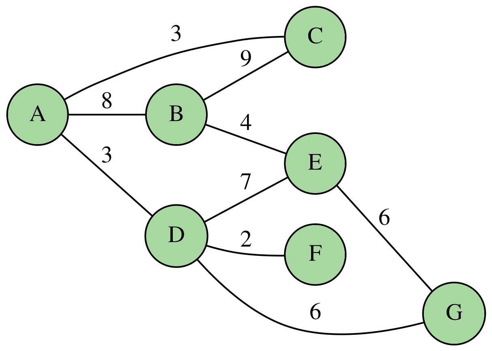
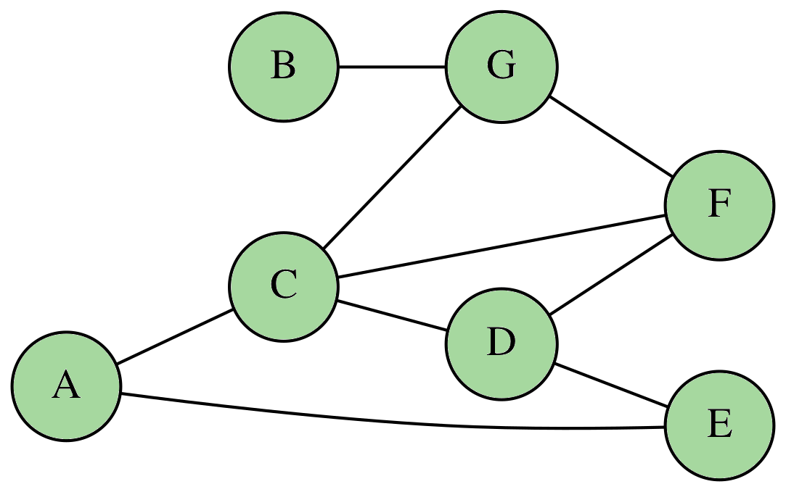
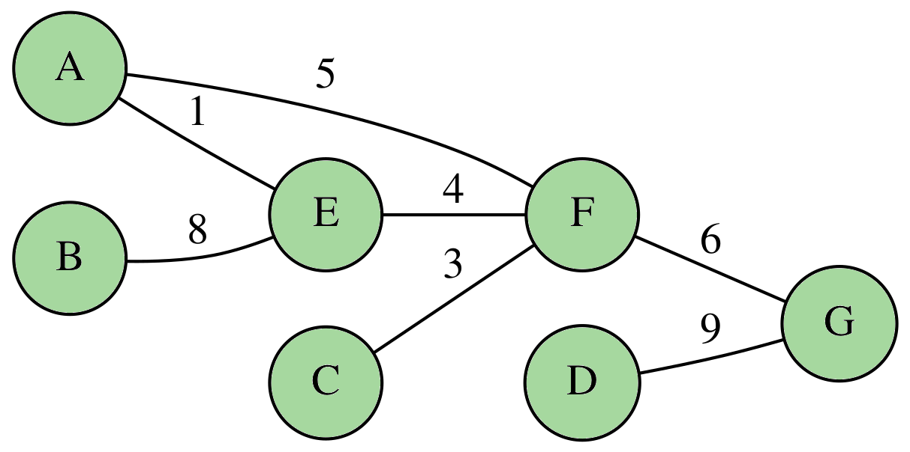
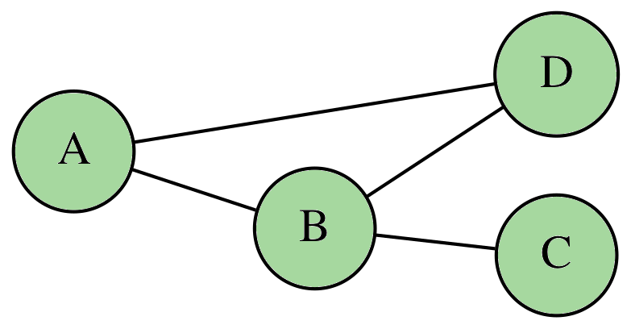

# Les graphes

## Généralités

De manière générale, un graphe permet de représenter les connexions d’un ensemble en exprimant les relations
entre ses éléments : réseau de communication, réseau routier, circuit électronique, ... , mais aussi relations
sociales ou interactions entre espèces animales.

!!! note "Les ponts de Königsberg"

   
    Le problème des sept ponts de Königsberg cherche à déterminer s'il existe un chemin permettant de revenir à son point de départ en empruntant une seule fois chaque pont de la ville. Leonhard Euler démontre en 1735 qu'un tel chemin n'existe pas.
    
    <center>
        
    </center>

La théorie des graphes est avant tout une branche à part entière et déjà ancienne des mathématiques. 
Néanmoins, l’importance accrue que revêt l’aspect algorithmique dans ses applications pratiques en fait aussi un domaine incontournable de l’informatique. 
Pour schématiser, les mathématiciens s’intéressent avant tout aux propriétés globales des graphes là où les
informaticiens vont plutôt chercher à concevoir des algorithmes efficaces pour résoudre un problème faisant intervenir un graphe.

### Les graphes simples

!!! abstract "Définition"

    En mathématiques, un graphe est un couple $G = (V, E)$ avec :

    * $V$ l'ensemble des sommets du graphe ;
        
    * $E$ l'ensemble des arêtes, chacune étant associée à un couple $\lbrace u, v \rbrace$ avec $u, v \in E$.

    Le nombre de sommets dans un graphe correspond à son **ordre**.

    ??? question "Pourquoi des accolades pour une arête ?"

        Pour décrire l'arête entre les sommets $u$ et $v$, on utilise la notation $\lbrace u, v\rbrace$ pour
        mettre en avant le fait que l'arête ne soit pas orientée.

!!! tip "Vocabulaire"

    S'il existe une arête entre deux sommets $u$ et $v$, on dit que ces sommets sont **adjacents**.

!!! example "Exemple de graphe"

    Mathématiquement, le graphe suivant :

    <center>
        
    </center>

    s'écrit $G = (V, E)$ avec :

    \[
        V = \lbrace A, B, C, D, E, F, G\rbrace \quad \textrm{et} \quad E = \left\lbrace \rule[0.5cm]{0cm}{0pt} \lbrace A, B \rbrace, \lbrace A, C\rbrace, \lbrace A, D\rbrace, \lbrace B, D \rbrace, \lbrace B, E\rbrace, \lbrace B, G\rbrace, \lbrace C, E\rbrace, \lbrace C,F \rbrace \right\rbrace
    \]

!!! abstract "Chaîne"

    Dans un graphe $G = (V, E)$, une **chaîne** reliant $u \in V$ à $v \in V$ est définie par une suite finie d'arêtes consécutives reliant $u$ à $v$.  
    S'il existe un chemin allant de $u \in V$ à $u$ on dit que c'est un **cycle**.

!!! abstract "Degré d'un sommet"

    Soit $G = (V, E)$ un graphe et $v \in V$ un sommet.  
    On note $\delta(v)$ le nombre de voisins de $v$. Ce nombre est aussi appelé le **degré** de $v$.

!!! example "Exemple"

    Dans le graphe précédent, on a $\delta(B) = 4$.

### Les graphes orientés

!!! abstract "Définition"

    On dit qu'un graphe est **orienté** lorsque les arêtes possèdent un sens.  
    L'arête $\lbrace u, v \rbrace$ est alors notée $(u, v)$ et est appelée **un arc**.

    Pour un arc $(u, v)$ donné :

    * le sommet $u$ est appelé **l'origine** ;
    * le sommet $v$ est appelé **la cible**.

    ??? warning "Attention !"

        Attention au changement de notation et de noms ! 

        L'arête $\lbrace u, v\rbrace$ laisse place à l'arc $(u, v)$.  
        De la même façon, on ne parle plus de **chaînes** mais de **chemins**.

!!! example "Exemple de graphe orienté"

    Mathématiquement, le graphe orienté suivant :

    <center>
        
    </center>

    s'écrit $G = (V, E)$ avec :

    \[
        V = \lbrace A, B, C, D, E, F, G\rbrace \quad \textrm{et} \quad E = \left\lbrace \rule[0.5cm]{0cm}{0pt} (A, C), (A, F), (B, A), (B, G), (C, D), (D, B), (D, E)\right\rbrace
    \]

!!! abstract "Degré entrant et sortant"

    Dans un graphe orienté, on distingue la notion de degré entrant noté $\delta^-$ de celle de degré sortant noté $\delta^+$.

!!! example "Exemple"

    Dans le graphe précédent, on a $\delta^-(D) = 1$ et $\delta^+(D) = 3$.

### Les graphes pondérés

!!! abstract "Définition"

    On dit qu'un graphe $G = (V, E)$ est **pondéré** si chaque arête (ou chaque arc) est associé à un nombre.  
    Ce nombre est alors appelé **le poids**.

!!! example "Exemple de graphe pondéré"

    Par exemple, le graphe suivant est pondéré.

    <center>
        
    </center>

    ??? warning "Attention"

        On peut pondérer un graphe simple mais aussi un graphe orienté.

## Implantation

On s'intéresse ici à la façon dont on implante un graphe en Python.

### Liste d'adjacence

!!! abstract "Définition"

    On considère un graphe $G = (V, E)$ à $n$ sommets.  
    
    On appelle **liste d'adjacence** de $G$, un tableau de taille $n$ où le $i$-ième élément correspond à la liste des voisins du sommet numéro $i$.

!!! example "Exemple"

    Dans le graphe 

    <center>
        
    </center>

    la liste d'adjacence se représente par :

    \[
        \begin{array}{ccl}
            \begin{array}{|c|}\hline A\\\hline\end{array} & \longrightarrow & \begin{array}{|c|c|}\hline C & E \\\hline\end{array}\\
            \begin{array}{|c|}\hline B\\\hline\end{array} & \longrightarrow & \begin{array}{|c|}\hline G \\\hline\end{array}\\
            \begin{array}{|c|}\hline C\\\hline\end{array} & \longrightarrow & \begin{array}{|c|c|c|c|}\hline A & D & F & G \\\hline\end{array}\\
            \begin{array}{|c|}\hline D\\\hline\end{array} & \longrightarrow & \begin{array}{|c|c|c|}\hline C & E & F\\\hline\end{array}\\
            \begin{array}{|c|}\hline E\\\hline\end{array} & \longrightarrow & \begin{array}{|c|c|}\hline A & D \\\hline\end{array}\\
            \begin{array}{|c|}\hline F\\\hline\end{array} & \longrightarrow & \begin{array}{|c|c|c|}\hline C & D & G\\\hline\end{array}\\
            \begin{array}{|c|}\hline G\\\hline\end{array} & \longrightarrow & \begin{array}{|c|c|c|}\hline B & C & F\\\hline\end{array}\\
        \end{array}
    \]

!!! info "Avantages"

    Si le graphe possède peu d'arêtes, cette représentation occupe peu de place en mémoire.

En python, on préconise l'utilisation de dictionnaire pour modéliser un graphe par sa liste d'adjacence.  
On fait évoluer la structure de données suivant que le graphe est pondéré ou non.

!!! example "Utilisation d'un dictionnaire"

    === "Graphe simple"

        <center>
            
        </center>

        En python, la liste d'adjacence pourrait s'écrire 

        ``` python title="Liste d'adjacence" linenums="1"
        G = {   'A' : ['E', 'F'],
                'B' : ['E'],
                'C' : ['F'],
                'D' : ['G'],
                'E' : ['A', 'B', 'F'],
                'F' : ['A', 'C', 'E', 'G'],
                'G' : ['D', 'F']}
        ```

    === "Graphe orienté"

        <center>
            
        </center>

        En python, la liste d'adjacence pourrait s'écrire 

        ``` python title="Liste d'adjacence" linenums="1"
        G = {   'A' : ['F'],
                'B' : [],
                'C' : ['F'],
                'D' : [],
                'E' : ['A', 'B'],
                'F' : ['E', 'G'],
                'G' : ['D']}
        ```

    === "Graphe pondéré"

        <center>
            
        </center>

        En python, la liste d'adjacence pourrait s'écrire 

        ``` python title="Liste d'adjacence" linenums="1"
        G = {   'A' : [('E', 1), ('F', 5)],
                'B' : [('E', 8)],
                'C' : [('F', 3)],
                'D' : [('G', 9)],
                'E' : [('A', 1), ('B', 8), ('F', 4)],
                'F' : [('A', 5), ('C', 3), ('E', 4), ('G', 6)],
                'G' : [('D', 9), ('F', 6)]}
        ```

### Matrice d'adjacence

Il existe différentes matrices que l'on peut associer à un graphe $G$.

!!! abstract "Définition"

    Soit $G = (V, E)$ un graphe où l'on note $S_1, S_2, \cdots, S_n$ les différents sommets.  
    On appelle **matrice d'adjacence** de $G$ le tableau de taille $n\times n$ où le coefficient 
    de la ligne $i$ et de la colonne $j$ est donné par :

    \[
        a_{i, j} = \left\lbrace \begin{array}{ll}1 & \textrm{si }S_i \textrm{ et } S_j \textrm{ sont adjacents}\\ 0 & \textrm{sinon}\end{array}\right.
    \]

!!! warning "Attention"

    Dans le cas d'un graphe orienté, le coefficient $a_{i, j}$ vaut $1$ seulement s'il existe un arc entre le sommet $S_i$ et le sommet $S_j$.

!!! example "Exemples"

    === "Graphe simple"

        <center>
            
        </center>

        La matrice d'adjacence associé à ce graphe est :

        \[
            \left(\begin{matrix}
                0 & 0 & 0 & 0 & 1 & 1 & 0\\
                0 & 0 & 0 & 0 & 1 & 0 & 0\\
                0 & 0 & 0 & 0 & 0 & 1 & 0\\
                0 & 0 & 0 & 0 & 0 & 0 & 1\\
                1 & 1 & 0 & 0 & 0 & 1 & 0\\
                1 & 0 & 1 & 0 & 1 & 0 & 1\\
                0 & 0 & 0 & 1 & 0 & 1 & 0
            \end{matrix}\right)    
        \]

    === "Graphe orienté"

        <center>
            
        </center>

        La matrice d'adjacence associé à ce graphe est :

        \[
            \left(\begin{matrix}
                0 & 0 & 0 & 0 & 0 & 1 & 0\\
                0 & 0 & 0 & 0 & 0 & 0 & 0\\
                0 & 0 & 0 & 0 & 0 & 1 & 0\\
                0 & 0 & 0 & 0 & 0 & 0 & 0\\
                1 & 1 & 0 & 0 & 0 & 0 & 0\\
                0 & 0 & 0 & 0 & 1 & 0 & 1\\
                0 & 0 & 0 & 1 & 0 & 0 & 0
            \end{matrix}\right)    
        \]

En python, on peut implanter une matrice d'adjacence avec une liste de liste.

!!! example "Exemple"

    La matrice $\left(\begin{matrix}0 & 1 & 0 & 1\\1 & 0 & 1 & 1\\0 & 1 & 0 & 0\\1 & 1 & 0 & 0\end{matrix}\right)$ peut s'implanter en python par le code :

    ``` python title="Matrice d'adjacence" linenums="1"
    [[0, 1, 0, 1], [1, 0, 1, 1], [0, 1, 0, 0], [1, 1, 0, 0]]
    ```

    !!! question "Aide mémoire"

        On recopie la matrice ligne par ligne.

On peut également utiliser le module **numpy** qui intègre un type **array** qui facilite certains calculs.

!!! example "Exemple"

    La matrice $\left(\begin{matrix}0 & 1 & 0 & 1\\1 & 0 & 1 & 1\\0 & 1 & 0 & 0\\1 & 1 & 0 & 0\end{matrix}\right)$ peut s'implanter en python par le code :

    ``` python title="Matrice d'adjacence" linenums="1"
    import numpy as np
    G = np.array([[0, 1, 0, 1], [1, 0, 1, 1], [0, 1, 0, 0], [1, 1, 0, 0]])
    ```

!!! abstract "Propriété"

    On note $A$ la matrice d'adjacence d'un graphe $G = (V, E)$ donné avec $S_1, S_2, \cdots, S_n$ les sommets de $G$.  

    Pour $k\in\mathbb{N}$, le coefficient de la ligne $i$ et de la colonne $j$ de la matrice $A^k$ correspond au nombre
    de chemins de longueur $k$ reliant les sommets $S_i$ et $S_j$.

!!! example "Exemple"

    Reprenons le graphe associé à la matrice $\left(\begin{matrix}0 & 1 & 0 & 1\\1 & 0 & 1 & 1\\0 & 1 & 0 & 0\\1 & 1 & 0 & 0\end{matrix}\right)$ dont
    une représentation est donnée par :

    <center>
        
    </center>

    On calcule $A^3$ à l'aide de python :

    ``` python title="Matrice d'adjacence" linenums="1"
    >>> import numpy as np
    >>> G = np.array([[0, 1, 0, 1], [1, 0, 1, 1], [0, 1, 0, 0], [1, 1, 0, 0]])
    >>> np.dot(G, np.dot(G, G))
    array([[2, 4, 1, 3],
           [4, 2, 3, 4],
           [1, 3, 0, 1],
           [3, 4, 1, 2]])
    ```

    Le coefficient de la ligne $1$ colonne $1$ vaut $2$ et correspond au nombre de chemins de longueur $3$ reliant $A$ à $A$. Ces chemins sont :
    
    \[
        A - B - D - A \qquad \textrm{et} \qquad A - D - B - A
    \]

    !!! question "Calcul de la puissance d'une matrice"

        La méthode `dot` du module `numpy` prend deux matrices en argument et réalise le produit de ces matrices.  
        Ainsi pour une matrice $A$ donnée, on écrit `np.dot(A, A)` pour calculer la matrice $A^2$.


## Parcours de graphe

### Parcours en profondeur

### Parcours en largeur d'abord