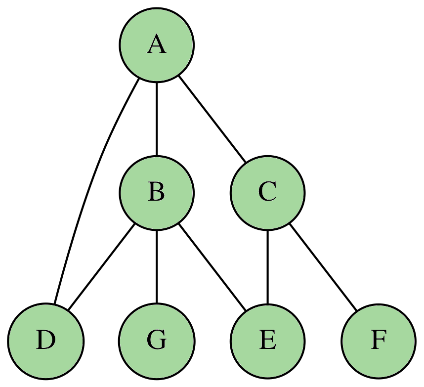

# Les graphes

## Généralités

De manière générale, un graphe permet de représenter les connexions d’un ensemble en exprimant les relations
entre ses éléments : réseau de communication, réseau routier, circuit électronique, ... , mais aussi relations
sociales ou interactions entre espèces animales.

!!! note "Les ponts de Königsberg"

   
    Le problème des sept ponts de Königsberg cherche à déterminer s'il existe un chemin permettant de revenir à son point de départ en empruntant une seule fois chaque pont de la ville. Leonhard Euler démontre en 1735 qu'un tel chemin n'existe pas.
    
    

        
    

La théorie des graphes est avant tout une branche à part entière et déjà ancienne des mathématiques. 
Néanmoins, l’importance accrue que revêt l’aspect algorithmique dans ses applications pratiques en fait aussi un domaine incontournable de l’informatique. 
Pour schématiser, les mathématiciens s’intéressent avant tout aux propriétés globales des graphes là où les
informaticiens vont plutôt chercher à concevoir des algorithmes efficaces pour résoudre un problème faisant intervenir un graphe.

### Présentation

!!! info "Définition mathématiques"

    En mathématiques, un graphe est un couple $G = (V, E)$ avec :

    * $V$ l'ensemble des sommets du graphe ;
        
    * $E$ l'ensemble des arêtes, chacune étant associée à un couple $\lbrace u, v \rbrace$ avec $u, v \in E$.

        ??? question "Pourquoi des accolades ?"

            Pour décrire l'arête entre les sommets $u$ et $v$, on utilise la notation $\lbrace u, v\rbrace$ pour
            mettre en avant le fait que l'arête n'est pas orientée.

!!! example "Un premier exemple"

    Mathématiquement, le graphe suivant :

    

        
    

    s'écrit $G = (V, E)$ avec :

    \[
        V = \lbrace A, B, C, D, E, F, G\rbrace \quad \textrm{et} \quad E = \left\lbrace \rule[0.5cm]{0cm}{0pt} \lbrace A, B \rbrace, \lbrace A, C\rbrace, \lbrace A, D\rbrace, \lbrace B, D \rbrace, \lbrace B, E\rbrace, \lbrace B, G\rbrace, \lbrace C, E\rbrace, \lbrace C,F \rbrace \right\rbrace
    \]

### Vocabulaire

## Implantation

### Avec des dictionnaires

### Avec une matrice

## Parcours de graphe

### Parcours en profondeur

### Parcours en largeur d'abordkd